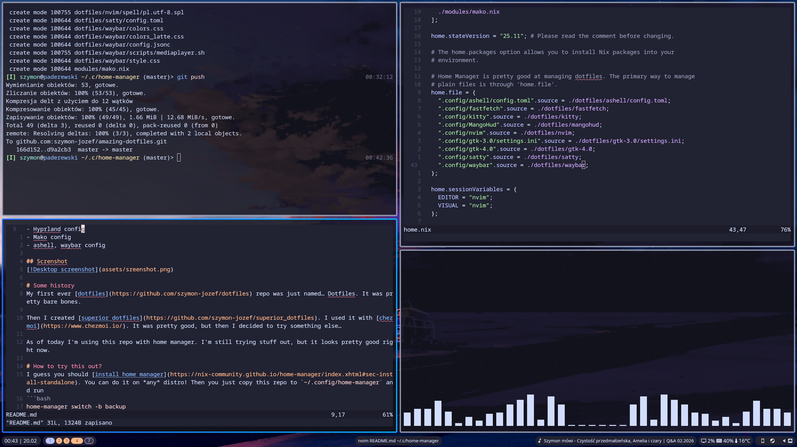

# My even cooler than previous dotfiles!
My dotfiles managed with [home manager](https://github.com/nix-community/home-manager)

# What's inside?
- Fish config
- Kitty config
- Hypr* stuff config
- Mako config
- ashell, waybar config
- nvim config

## Screenshot



# Some history
My first ever [dotfiles](https://github.com/szymon-jozef/dotfiles) repo was just named… Dotfiles. It was pretty bare bones.

Then I created [superior dotfiles](https://github.com/szymon-jozef/superior_dotfiles). I used it with [chezmoi](https://www.chezmoi.io/). It was pretty good, but then I decided to try something else…

As of today I'm using this repo with home manager. I'm still trying stuff out, but it looks pretty good right now.

# How to try this out?
I guess you should [install home manager](https://nix-community.github.io/home-manager/index.xhtml#sec-install-standalone). You can do it on *any* distro! Then you just copy this repo to `~/.config/home-manager` and run
```bash
home-manager switch -b backup
```

---

I hope you'll enjoy it, if you for whatever reason want to try this random ass dotfiles found on the internet…
